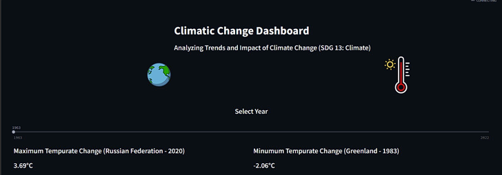
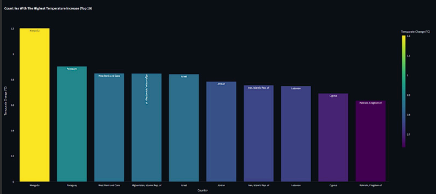
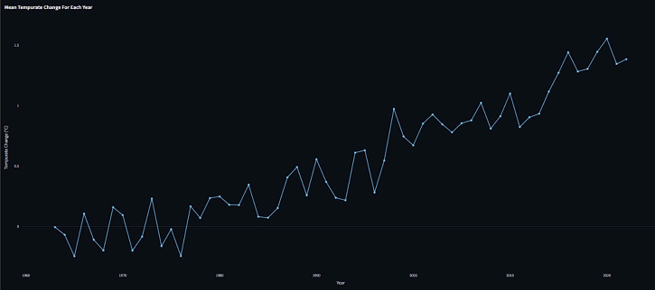

Dhruvayu :  A comprehensive dashboard that analyzes climate change data to identify trends, patterns, and impacts on a global scale.        
Link for the Dataset --> [Dataset](climate_change_indicators.csv)

   **Indicators representing the mean temperature increased over the years.**

  **Bar-Graph indicating the countries with high mean temperature.**

